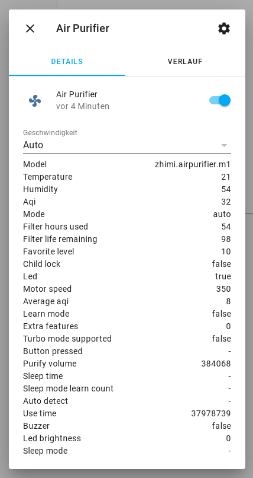
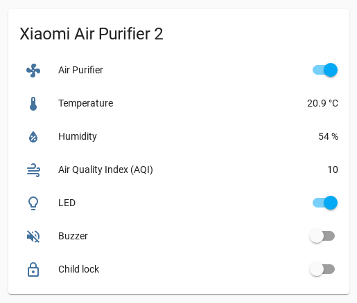
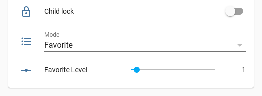

# Xiaomi Mi Air Purifier & Xiaomi Mi Air Humidifier


[](https://www.buymeacoffee.com/syssi)

This is a custom component for home assistant to integrate the Xiaomi Mi Air Purifier 2, Air Purifier 2S, Air Purifier Pro, Air Humidifier, Air Fresh and Pedestal Fan.

Please follow the instructions on [Retrieving the Access Token](https://home-assistant.io/components/xiaomi/#retrieving-the-access-token) to get the API token to use in the configuration.yaml file.

Credits: Thanks to [Rytilahti](https://github.com/rytilahti/python-miio) for all the work.

## What is the difference between this custom component and the one in Home Assistant Core?

This custom component is more or less the beta version of the [official component](https://www.home-assistant.io/integrations/xiaomi_miio/). Furthermore, this custom component supports a number of additional devices which cannot be merged into the official component at the moment. The handling/values of the `fan_speed` property need to be refactored first because this and the official component don't align with some new architecture decisions.

## Supported devices

| Name                   | Model                  | Model no. | Specs |
| ---------------------- | ---------------------- | --------- | ----- |
| Air Purifier           | zhimi.airpurifier.v1   | | |
| Air Purifier 2         | zhimi.airpurifier.v2   | FJY4006CN, AC-M2-AA  | 37m<sup>2</sup>, 310m<sup>3</sup>/h CADR, 31W  |
| Air Purifier V3        | zhimi.airpurifier.v3   | | |
| Air Purifier V5        | zhimi.airpurifier.v5   | | |
| Air Purifier Pro       | zhimi.airpurifier.v6   | | |
| Air Purifier Pro V7    | zhimi.airpurifier.v7   | | |
| Air Purifier 2 (mini)  | zhimi.airpurifier.m1   | | |
| Air Purifier (mini)    | zhimi.airpurifier.m2   | | |
| Air Purifier MA1       | zhimi.airpurifier.ma1  | | |
| Air Purifier MA2       | zhimi.airpurifier.ma2  | | |
| Air Purifier 2S        | zhimi.airpurifier.mc1  | XM200003<strong>(?)</strong>, AC-M4-AA  | 37m<sup>2</sup>, 310m<sup>3</sup>/h CADR, 66dB, 29W (max)  |
| Air Purifier 2H        | zhimi.airpurifier.mc2  | FJY4026GL<strong>(?)</strong>, AC-M9-AA  | 31m<sup>2</sup>, 260m<sup>3</sup>/h CADR, 66dB, 31W (max)  |
| Air Purifier Super     | zhimi.airpurifier.sa1  | | |
| Air Purifier Super 2   | zhimi.airpurifier.sa2  | | |
| Air Purifier 3 (2019)  | zhimi.airpurifier.ma4  | | |
| Air Purifier 3H (2019) | zhimi.airpurifier.mb3  | FJY4031GL<strong>(?)</strong>, XM200017 | 45m<sup>2</sup>, 380m<sup>3</sup>/h CADR, 64dB, 38W (max) |
| Air Purifier ZA1       | zhimi.airpurifier.za1   | | |
| Air Dog X3             | airdog.airpurifier.x3  | | |
| Air Dog X5             | airdog.airpurifier.x5  | | |
| Air Dog X7SM           | airdog.airpurifier.x7sm | | |
| Air Humidifier         | zhimi.humidifier.v1    | | |
| Air Humidifier CA1     | [zhimi.humidifier.ca1](docs/zhimi.humidifier.ca1.yaml)   | CJXJSQ02ZM, SKV6001RT  | 8W, 240x240x363mm  |
| Smartmi Humidifier Evaporator 2  | zhimi.humidifier.ca4   | CJXJSQ04ZM  | |
| Smartmi Evaporative Humidifier   | zhimi.humidifier.cb1   | CJXJSQ02ZM, SKV6001EU  | 8W, 240x240x363mm  |
| Smartmi Evaporative Humidifier (Korea Version)  | zhimi.humidifier.cb2   | CJXJSQ02ZM  | 8W, 240x240x363mm  |
| Mijia Smart Sterilization Humidifier S  | deerma.humidifier.mjjsq  | MJJSQ03DY  | 4.5L, <=39dB, 450mL/h, 40W  |
| Mijia Intelligent Sterilization Humidifier (EU version?) | deerma.humidifier.jsq  | ZNJSQ01DEM  | 4.5L, <=38dB, 300mL/h, 24W  |
| Mijia Intelligent Sterilization Humidifier (EU version?) | deerma.humidifier.jsq5  | ZNJSQ01DEM  | 4.5L, <=38dB, 300mL/h, 24W  |
| Mijia Smart Sterilization Humidifier S (EU version?) | deerma.humidifier.jsqs  | MJJSQ03DY  | 4.5L, <=39dB, 450mL/h, 40W  |
| Mijia Intelligent Sterilization Humidifier SCK0A45  | deerma.humidifier.jsq1  | SCKOA45, SCK0A45  | 4.5L, <=38dB, 300mL/h, 25W |
| Zero Fog Humidifier    | shuii.humidifier.jsq001   | | |
| New Widetech Internet Dehumidifier  | nwt.derh.wdh318efw1  | WDH318EFW1  | 2.7L tank, 38dB, 18L/d, 240W |
| Smartmi Fresh Air System XFXT01ZM        | zhimi.airfresh.va2  | XFXT01ZM     | |
| Smartmi Fresh Air System XFXTDFR02ZM     | zhimi.airfresh.va4  | XFXTDFR02ZM  | PTC/Heater support |
| Mi Fresh Air Ventilator  | [dmaker.airfresh.t2017](docs/dmaker-airfresh-t2017.md)  | MJXFJ-300-G1**?** | 300m3/h (Air volume), 35W, 36db(A), 16kg |
| Mi Fresh Air Ventilator  | [dmaker.airfresh.a1](docs/dmaker.airfresh.a1.yaml)  | MJXFJ-150-A1  | 150m<sup>3</sup>/h (Air volume), 20W, 36db(A), 8kg |
| Pedestal Fan Fan V2    | zhimi.fan.v2           | | |
| Pedestal Fan Fan V3    | zhimi.fan.v3           | | |
| Pedestal Fan Fan SA1   | zhimi.fan.sa1          | | |
| Pedestal Fan Fan ZA1   | zhimi.fan.za1          | | |
| Pedestal Fan Fan ZA3   | zhimi.fan.za3          | | |
| Pedestal Fan Fan ZA4   | zhimi.fan.za4          | | |
| Pedestal Fan Fan 1C    | dmaker.fan.1c          | | |
| Pedestal Fan Fan P5    | dmaker.fan.p5          | | |
| Pedestal Fan Fan P8     | dmaker.fan.p8         | | |
| Pedestal Fan Fan P9     | dmaker.fan.p9         | | |
| Pedestal Fan Fan P10    | dmaker.fan.p10        | | |
| Mijia Pedestal Fan      | dmaker.fan.p11        | BPLDS03DM  | 2800mAh, 24W, <=58dB  |
| Rosou SS4 Ventilator    | leshow.fan.ss4        | | |

Support unknown / Testing required:
- Mijia Humidifier 4L (MJJSQ04DY), 300ml/h, 25W, <=38dB: Please create an issue if you own this device.

Unsupported devices:
- Mijia Humidifer 4L (MJJSQ02LX): This device isn't smart / has no WiFi support.

## Features

### Air Purifier 2 et al.

- Power (on, off)
- Preset modes (auto, silent, favorite, idle)
- Buzzer (on, off)
- Child lock (on, off)
- LED (on, off), LED brightness (bright, dim, off)
- Favorite Level (0...16)
- Attributes
  - `model`
  - `temperature`
  - `humidity`
  - `aqi`
  - `mode`
  - `filter_hours_used`
  - `filter_life_remaining`
  - `favorite_level`
  - `child_lock`
  - `led`
  - `motor_speed`
  - `average_aqi`
  - `purify_volume`
  - `learn_mode`
  - `sleep_time`
  - `sleep_mode_learn_count`
  - `extra_features`
  - `turbo_mode_supported`
  - `auto_detect`
  - `use_time`
  - `button_pressed`
  - `buzzer`
  - `led_brightness`
  - `sleep_mode`

### Air Purifier 2H (zhimi.airpurifier.mc2)

- Power (on, off)
- Preset modes (auto, silent, favorite, idle)
- Buzzer (on, off)
- Child lock (on, off)
- LED (on, off), LED brightness (bright, dim, off)
- Favorite Level (0...16)
- Attributes
  - `model`
  - `temperature`
  - `humidity`
  - `aqi`
  - `mode`
  - `filter_hours_used`
  - `filter_life_remaining`
  - `favorite_level`
  - `child_lock`
  - `led`
  - `motor_speed`
  - `average_aqi`
  - `learn_mode`
  - `extra_features`
  - `turbo_mode_supported`
  - `buzzer`
  - `led_brightness`

### Air Purifier Pro (zhimi.airpurifier.v6)

- Power (on, off)
- Preset modes (auto, silent, favorite)
- Child lock (on, off)
- LED (on, off)
- Favorite Level (0...16)
- Attributes
  - `model`
  - `temperature`
  - `humidity`
  - `aqi`
  - `mode`
  - `filter_hours_used`
  - `filter_life_remaining`
  - `favorite_level`
  - `child_lock`
  - `led`
  - `motor_speed`
  - `average_aqi`
  - `purify_volume`
  - `learn_mode`
  - `sleep_time`
  - `sleep_mode_learn_count`
  - `extra_features`
  - `turbo_mode_supported`
  - `auto_detect`
  - `use_time`
  - `button_pressed`
  - `filter_rfid_product_id`
  - `filter_rfid_tag`
  - `filter_type`
  - `illuminance`
  - `motor2_speed`
  - `volume`

### Air Purifier Pro V7 (zhimi.airpurifier.v7)

- Power (on, off)
- Preset modes (auto, silent, favorite)
- Child lock (on, off)
- LED (on, off)
- Favorite Level (0...16)
- Attributes
  - `model`
  - `temperature`
  - `humidity`
  - `aqi`
  - `mode`
  - `filter_hours_used`
  - `filter_life_remaining`
  - `favorite_level`
  - `child_lock`
  - `led`
  - `motor_speed`
  - `average_aqi`
  - `learn_mode`
  - `extra_features`
  - `turbo_mode_supported`
  - `button_pressed`
  - `filter_rfid_product_id`
  - `filter_rfid_tag`
  - `filter_type`
  - `illuminance`
  - `motor2_speed`
  - `volume`

### Air Purifier 2S (zhimi.airpurifier.mc1) and 2H (zhimi.airpurifier.mc2)

- Power (on, off)
- Preset modes (auto, silent, favorite)
- Buzzer (on, off)
- Child lock (on, off)
- LED (on, off)
- Favorite Level (0...16)
- Attributes
  - `model`
  - `temperature`
  - `humidity`
  - `aqi`
  - `mode`
  - `filter_hours_used`
  - `filter_life_remaining`
  - `favorite_level`
  - `child_lock`
  - `led`
  - `motor_speed`
  - `average_aqi`
  - `learn_mode`
  - `extra_features`
  - `turbo_mode_supported`
  - `button_pressed`
  - `filter_rfid_product_id`
  - `filter_rfid_tag`
  - `filter_type`
  - `illuminance`
  - `buzzer`

### Air Purifier 3/3H (2019) (zhimi.airpurifier.ma4/zhimi.airpurifier.mb3)

This model uses newer MiOT communication protocol.

- Power (on, off)
- Preset modes (auto, silent, favorite, fan)
- Buzzer (on, off)
- Child lock (on, off)
- LED (on, off)
- Favorite Level (0...16)
- Fan Level (1...3)
- Attributes
  - `model`
  - `temperature`
  - `humidity`
  - `aqi`
  - `mode`
  - `filter_hours_used`
  - `filter_life_remaining`
  - `favorite_level`
  - `child_lock`
  - `led`
  - `motor_speed`
  - `average_aqi`
  - `purify_volume`
  - `use_time`
  - `buzzer`
  - `led_brightness`
  - `filter_rfid_product_id`
  - `filter_rfid_tag`
  - `filter_type`
  - `fan_level`

### Air Purifier V3 (zhimi.airpurifier.v3)

- Power (on, off)
- Preset modes (auto, silent, favorite, idle, medium, high, strong)
- Child lock (on, off)
- LED (on, off)
- Attributes
  - `model`
  - `aqi`
  - `mode`
  - `led`
  - `buzzer`
  - `child_lock`
  - `illuminance`
  - `filter_hours_used`
  - `filter_life_remaining`
  - `motor_speed`
  - `average_aqi`
  - `volume`
  - `motor2_speed`
  - `filter_rfid_product_id`
  - `filter_rfid_tag`
  - `filter_type`
  - `purify_volume`
  - `learn_mode`
  - `sleep_time`
  - `sleep_mode_learn_count`
  - `extra_features`
  - `auto_detect`
  - `use_time`
  - `button_pressed`

### Air Humidifier (zhimi.humidifier.v1)

- On, Off
- Preset modes (silent, medium, high, strong)
- Buzzer (on, off)
- Child lock (on, off)
- LED (on, off), LED brightness (bright, dim, off)
- Target humidity (30, 40, 50, 60, 70, 80)
- Attributes
  - `model`
  - `temperature`
  - `humidity`
  - `mode`
  - `buzzer`
  - `child_lock`
  - `trans_level`
  - `target_humidity`
  - `led_brightness`
  - `button_pressed`
  - `use_time`
  - `hardware_version`

### Air Humidifier CA (zhimi.humidifier.ca1)

- On, Off
- Preset modes (silent, medium, high, auto)
- Buzzer (on, off)
- Child lock (on, off)
- LED (on, off), LED brightness (bright, dim, off)
- Target humidity (30, 40, 50, 60, 70, 80)
- Dry mode (on, off)
- Attributes
  - `model`
  - `temperature`
  - `humidity`
  - `mode`
  - `buzzer`
  - `child_lock`
  - `trans_level`
  - `target_humidity`
  - `led_brightness`
  - `button_pressed`
  - `use_time`
  - `hardware_version`
  - `motor_speed`
  - `depth`
  - `dry`

### Air Humidifier CA4 (zhimi.humidifier.ca4)

- On, Off
- Preset modes (auto, low, mid, high)
- Buzzer (on, off)
- Child lock (on, off)
- LED brightness (off, dim, bright)
- Target humidity (30 - 80)
- Dry mode (on, off)
- Clean mode (on, off)
- Motor speed rpm (200 - 2000)
- Attributes
  - `model`
  - `temperature`
  - `humidity`
  - `mode`
  - `buzzer`
  - `child_lock`
  - `target_humidity`
  - `led_brightness`
  - `use_time`
  - `actual_speed`
  - `button_pressed`
  - `dry`
  - `fahrenheit`
  - `motor_speed`
  - `power_time`
  - `water_level`
  - `use_time`
  - `clean_mode`

### Air Humidifier CB (zhimi.humidifier.cb1)

- On, Off
- Preset modes (silent, medium, high, auto)
- Buzzer (on, off)
- Child lock (on, off)
- LED (on, off), LED brightness (bright, dim, off)
- Target humidity (30, 40, 50, 60, 70, 80)
- Dry mode (on, off)
- Attributes
  - `speed`
  - `speed_list`
  - `model`
  - `temperature`
  - `humidity`
  - `mode`
  - `buzzer`
  - `child_lock`
  - `target_humidity`
  - `led_brightness`
  - `use_time`
  - `hardware_version`
  - `motor_speed`
  - `depth`
  - `dry`
  - `supported_features`

### Zero Fog Humidifier (shuii.humidifier.jsq001)

- Power (on, off)
- Preset modes (Intelligent, Level1, Level2, Level3, Level4)
- Buzzer (on, off)
- Child lock (on, off)
- LED (on, off), LED brightness (high, low, off)
- Attributes
  - `model`
  - `temperature`
  - `humidity`
  - `mode`
  - `buzzer`
  - `child_lock`
  - `led`
  - `led_brightness`
  - `no_water`
  - `lid_opened`

### Air Fresh VA2 and VA4 (zhimi.airfresh.va2, zhimi.airfresh.va4)

- Power (on, off)
- Preset modes (auto, silent, interval, low, middle, strong)
- Buzzer (on, off)
- Child lock (on, off)
- LED (on, off), LED brightness (bright, dim, off)
- PTC (on, off) (zhimi.airfresh.va4 only)
- Attributes
  - `model`
  - `aqi`
  - `average_aqi`
  - `temperature`
  - `humidity`
  - `co2`
  - `mode`
  - `led`
  - `led_brightness`
  - `buzzer`
  - `child_lock`
  - `filter_life_remaining`
  - `filter_hours_used`
  - `use_time`
  - `motor_speed`
  - `extra_features`
  - `ptc` (zhimi.airfresh.va4 only)
  - `ntc_temperature` (zhimi.airfresh.va4 only)

### Mi Fresh Air Ventilator (dmaker.airfresh.t2017, dmaker.airfresh.a1)

This paragraph was moved to [docs/dmaker-airfresh-t2017.md](docs/dmaker-airfresh-t2017.md).

### Air Humidifier MJJSQ, JSQ1, JSQ5 and JSQS (deerma.humidifier.mjjsq, deerma.humidifier.jsq1, deerma.humidifier.jsq5, deerma.humidifier.jsqs)

* Power (on, off)
* Preset modes (low, medium, high, humidity)
* Buzzer (on, off)
* LED (on, off)
* Target humidity (0...99)
* Wet protection (on, off) (deerma.humidifier.jsq1 only)
* Attributes
  - `model`
  - `temperature`
  - `humidity`
  - `mode`
  - `buzzer`
  - `target_humidity`
  - `led`
  - `no_water`
  - `water_tank_detached`
  - `wet_protection` (deerma.humidifier.jsq1 only)

### Air Dehumidifier (nwt.derh.wdh318efw1)

* HVAC mode (dry, off)
* Preset modes (on, auto, dryCloth)
* Target humidity (40, 50, 60)
* Fan mode (sleep, low, medium, high, strong)
* Buzzer (on, off)
* Child lock (on, off)
* LED (on, off)
* Attributes
  - `model`
  - `_current_temperature`
  - `humidity`
  - `mode`
  - `buzzer`
  - `child_lock`
  - `target_humidity`
  - `led`
  - `fan_speed`
  - `tank_full`
  - `compressor_status`
  - `defrost_status`
  - `fan_st`
  - `alarm`


### Pedestal Fan

* Power (on, off)
* Preset modes (Level 1, Level 2, Level 3, Level 4)
* Speed percentage (0...100)
* Oscillate (on, off)
* Oscillation angle (30, 60, 90, 120, 140, 150)
* Natural mode (on, off)
* Rotate by 5 degrees (left, right)
* Child lock (on, off)
* LED brightness (bright, dim, off)
* Attributes
  - `model`
  - `temperature` (zhimi.fan.v2 and v3 only)
  - `humidity` (zhimi.fan.v2 and v3 only)
  - `led_brightness`
  - `buzzer`
  - `child_lock`
  - `natural_level`
  - `oscillate`
  - `delay_off_countdown`
  - `speed`
  - `direct_speed`
  - `natural_speed`
  - `angle`
  - `use_time`
  - `ac_power`
  - `battery` (zhimi.fan.v2 and v3 only)
  - `battery_charge` (zhimi.fan.v2 & v3 only)
  - `button_pressed` (zhimi.fan.v2 & v3 only)
  - `led` (zhimi.fan.v2 only)
  - `battery_state` (zhimi.fan.v2 only)

### Rosou SS4 Ventilator (leshow.fan.ss4)

* Power (on, off)
* Operation modes (manual, sleep, strong, natural)
* Preset modes (Level 1, Level 2, Level 3, Level 4)
* Speed percentage (0...100)
* Oscillate (on, off)
* Buzzer (on, off)
* Delayed turn off (minutes)

* Attributes
  - `model`
  - `mode`
  - `speed`
  - `buzzer`
  - `oscillate`
  - `delay_off_countdown`
  - `error_detected`


## Install

You can install this custom component via [HACS](https://hacs.xyz/). Search for for 'Xiaomi Mi Air Purifier and Xiaomi Mi Air Humidifier Integration' at the integration page of HACS. Alternatively, you can install it manually by copying the custom_compon
ent folder to your Home Assistant configuration folder.

As next step you have to setup the custom component at your `configuration.yaml`. This custom component doesn't provide a `config-flow` right now. A restart of Home Assistant is required afterwards.


## Setup

```yaml
# configuration.yaml

fan:
  - platform: xiaomi_miio_airpurifier
    name: Xiaomi Air Purifier 2
    host: 192.168.130.71
    token: b7c4a758c251955d2c24b1d9e41ce47d
    model: zhimi.airpurifier.m1

  - platform: xiaomi_miio_airpurifier
    name: Xiaomi Air Purifier Pro
    host: 192.168.130.73
    token: 70924d6fa4b2d745185fa4660703a5c0
    model: zhimi.airpurifier.v6

  - platform: xiaomi_miio_airpurifier
    name: Xiaomi Air Humidifier
    host: 192.168.130.72
    token: 2b00042f7481c7b056c4b410d28f33cf
    model: zhimi.humidifier.v1

  - platform: xiaomi_miio_airpurifier
    name: Xiaomi Air Fresh
    host: 192.168.130.74
    token: 91d89cf53c4090f4c653174f6737102f
    model: zhimi.airfresh.va2

  - platform: xiaomi_miio_airpurifier
    name: Xiaomi Smart Fan
    host: 192.168.130.75
    token: b7c4a758c251955d2c24b1d9e41ce4ff

climate:
  - platform: xiaomi_miio_airpurifier
    name: Xiaomi Air Dehumidifier
    host: 192.168.130.76
    token: 86c4c41dc7af0e0520e170c8a1f92f62
```

Configuration variables:
- **host** (*Required*): The IP of your light.
- **token** (*Required*): The API token of your light.
- **name** (*Optional*): The name of your light.
- **model** (*Optional*): The model of your device. This setting can be used to bypass the device model detection and is recommended if your device isn't always available.



## Template sensor example

If your entity has another name the value `xiaomi_air_purifier` and `xiaomi_air_humidifier` must be updated.

```
# configuration.yaml

sensor:
  - platform: template
    sensors:
      airpurifier_aqi:
        friendly_name: Air Purifier Air Quality Index
        value_template: '{{ states.fan.xiaomi_air_purifier.attributes.aqi }}'
        icon_template: mdi:weather-windy
      airpurifier_temperature:
        friendly_name: Air Purifier Temperature
        value_template: '{{ states.fan.xiaomi_air_purifier.attributes.temperature }}'
        unit_of_measurement: '°C'
      airpurifier_humidity:
        friendly_name: Air Purifier Humidity
        value_template: '{{ states.fan.xiaomi_air_purifier.attributes.humidity }}'
        unit_of_measurement: '%'
        icon_template: mdi:water-percent

      airhumidifier_temperature:
        friendly_name: Air Humidifier Temperature
        value_template: '{{ states.fan.xiaomi_air_humidifier.attributes.temperature }}'
        unit_of_measurement: '°C'
      airhumidifier_humidity:
        friendly_name: Air Humidifier Humidity
        value_template: '{{ states.fan.xiaomi_air_humidifier.attributes.humidity }}'
        unit_of_measurement: '%'
        icon_template: mdi:water-percent
```

## Template switch example

```
switch:
  - platform: template
    switches:
      xiaomi_airpurifier_child_lock:
        friendly_name: "Child lock"
        value_template: "{{ is_state_attr('fan.xiaomi_air_purifier', 'child_lock', True) }}"
        turn_on:
          service: xiaomi_miio_airpurifier.fan_set_child_lock_on
          data:
            entity_id: fan.xiaomi_air_purifier
        turn_off:
          service: xiaomi_miio_airpurifier.fan_set_child_lock_off
          data:
            entity_id: fan.xiaomi_air_purifier
        icon_template: "mdi:lock-outline"

      xiaomi_airpurifier_buzzer:
        friendly_name: "Buzzer"
        value_template: "{{ is_state_attr('fan.xiaomi_air_purifier', 'buzzer', True) }}"
        turn_on:
          service: xiaomi_miio_airpurifier.fan_set_buzzer_on
          data:
            entity_id: fan.xiaomi_air_purifier
        turn_off:
          service: xiaomi_miio_airpurifier.fan_set_buzzer_off
          data:
            entity_id: fan.xiaomi_air_purifier
        icon_template: "mdi:volume-off"

      xiaomi_airpurifier_led:
        friendly_name: "LED"
        value_template: "{{ is_state_attr('fan.xiaomi_air_purifier', 'led', True) }}"
        turn_on:
          service: xiaomi_miio_airpurifier.fan_set_led_on
          data:
            entity_id: fan.xiaomi_air_purifier
        turn_off:
          service: xiaomi_miio_airpurifier.fan_set_led_off
          data:
            entity_id: fan.xiaomi_air_purifier
        icon_template: "mdi:lightbulb-outline"
```



## Input select example

```
input_select:
  airpurifier_mode:
    name: Operation mode
    options:
     - Low
     - Medium
     - High
     - Humidity

automation:
  - alias: Select operation mode by input select
    trigger:
      entity_id: input_select.airpurifier_mode
      platform: state
    action:
      service: fan.set_speed
      data_template:
        entity_id: fan.xiaomi_air_purifier
        speed: '{{ states.input_select.airpurifier_mode.state }}'

  - alias: Monitor operation mode and update input select
    trigger:
      platform: state
      entity_id: fan.xiaomi_air_purifier
    action:
      service: input_select.select_option
      entity_id: input_select.airpurifier_mode
      data_template:
        option: '{{ states.fan.xiaomi_air_purifier.attributes.speed }}'
```

## Input number example

```
sensor:
  - platform: template
    sensors:
      airpurifier_favorite_level:
        friendly_name: Favorite level
        value_template: '{{ states.fan.xiaomi_air_purifier.attributes.favorite_level }}'

input_number:
  airpurifier_favorite_level:
    name: Favorite Level
    initial: 1
    min: 0
    max: 16
    step: 1

automation:
  - alias: Select favorite level by slider
    trigger:
      platform: state
      entity_id: input_number.airpurifier_favorite_level
    action:
      - service: xiaomi_miio_airpurifier.fan_set_favorite_level
        data_template:
          entity_id: fan.xiaomi_air_purifier
          level: '{{ states.input_number.airpurifier_favorite_level.state|int }}'

  - alias: Monitor favorite level and update slider
    trigger:
      platform: state
      entity_id: sensor.airpurifier_favorite_level
    action:
      service: input_number.set_value
      entity_id: input_number.airpurifier_favorite_level
      data_template:
        value: '{{ states.fan.xiaomi_air_purifier.attributes.favorite_level }}'
```



The following example can be used to setup a `input_numer` entity to control the target humidity of an Air Humidifier. Make sure to replace all occurrences of `fan.xiaomi_air_humidifier` with the `entity_id` of your device.

```
sensor:
  - platform: template
    sensors:
      airhumidifier_target_humidity:
        friendly_name: Target humidity
        value_template: '{{ states.fan.xiaomi_air_humidifier.attributes.target_humidity }}'
        unit_of_measurement: '%'
        icon_template: mdi:water-percent

input_number:
  airhumidifier_target_humidity:
    name: Target humidity
    min: 1
    max: 99
    step: 1

automation:
  - alias: Select target humidity by slider
    trigger:
      platform: state
      entity_id: input_number.airhumidifier_target_humidity
    action:
      - service: xiaomi_miio_airpurifier.fan_set_target_humidity
        data_template:
          entity_id: fan.xiaomi_air_humidifier
          humidity: '{{ states.input_number.airhumidifier_target_humidity.state|int }}'

  - alias: Monitor target humidity and update slider
    trigger:
      platform: state
      entity_id: sensor.airhumidifier_target_humidity
    action:
      service: input_number.set_value
      entity_id: input_number.airhumidifier_target_humidity
      data_template:
        value: '{{ states.fan.xiaomi_air_humidifier.attributes.target_humidity }}'
```

## Debugging

If the custom component doesn't work out of the box for your device please update your configuration to increase the log level:

```
logger:
  default: warn
  logs:
    custom_components.xiaomi_miio_airpurifier: debug
    miio: debug
```

## Platform services

#### Service `fan.set_preset_mode`

Set the fan operation/preset mode.

| Service data attribute    | Optional | Description                                                          |
|---------------------------|----------|----------------------------------------------------------------------|
| `entity_id`               |       no | Only act on a specific Xiaomi miIO fan entity.                       |
| `preset_mode`             |       no | Preset mode. Valid values are `Auto`, `Silent`, `Favorite` and `Idle`. Valid values of the Pedestal Fan are `Level 1`, `Level 2`, `Level 3` and `Level 4`. |

#### Service `fan.set_percentage` (Pedestal Fan only)

Set the fan speed percentage.

| Service data attribute    | Optional | Description                                                          |
|---------------------------|----------|----------------------------------------------------------------------|
| `entity_id`               |       no | Only act on a specific Xiaomi miIO fan entity.                       |
| `percentage`              |       no | Percentage speed setting. Valid values are between 0 and 100. |

#### Service `xiaomi_miio_airpurifier.fan_set_buzzer_on` (Air Purifier Pro excluded)

Turn the buzzer on.

| Service data attribute    | Optional | Description                                           |
|---------------------------|----------|-------------------------------------------------------|
| `entity_id`               |       no | Only act on a specific Xiaomi miIO fan entity.        |

#### Service `xiaomi_miio_airpurifier.fan_set_buzzer_off` (Air Purifier Pro excluded)

Turn the buzzer off.

| Service data attribute    | Optional | Description                                             |
|---------------------------|----------|---------------------------------------------------------|
| `entity_id`               |       no | Only act on a specific Xiaomi miIO fan entity.          |

#### Service `xiaomi_miio_airpurifier.fan_set_led_on` (Air Purifier only)

Turn the led on.

| Service data attribute    | Optional | Description                                             |
|---------------------------|----------|---------------------------------------------------------|
| `entity_id`               |       no | Only act on a specific Xiaomi miIO fan entity.          |

#### Service `xiaomi_miio_airpurifier.fan_set_led_off` (Air Purifier only)

Turn the led off.

| Service data attribute    | Optional | Description                                             |
|---------------------------|----------|---------------------------------------------------------|
| `entity_id`               |       no | Only act on a specific Xiaomi miIO fan entity.          |

#### Service `xiaomi_miio_airpurifier.fan_set_child_lock_on`

Turn the child lock on.

| Service data attribute    | Optional | Description                                             |
|---------------------------|----------|---------------------------------------------------------|
| `entity_id`               |       no | Only act on a specific Xiaomi miIO fan entity.          |

#### Service `xiaomi_miio_airpurifier.fan_set_child_lock_off`

Turn the child lock off.

| Service data attribute    | Optional | Description                                             |
|---------------------------|----------|---------------------------------------------------------|
| `entity_id`               |       no | Only act on a specific Xiaomi miIO fan entity.          |

#### Service `xiaomi_miio_airpurifier._fan_set_delay_off`

Set the scheduled turn off time. Supported values are 0, 60, 120, 180, 240, 300, 360, 420, 480 minutes. When 0 is passed, delay_off is disabled.

| Service data attribute    | Optional | Description                                                                                                          |
|---------------------------|----------|----------------------------------------------------------------------------------------------------------------------|
| `entity_id`               |       no | Only act on a specific Xiaomi miIO fan entity.                                                                       |
| `delay_off_countdown`     |       no | Time in minutes. Valid values are `0`, `60`, `120`, `180`, `240`, `300`, `240`, `300`, `360`, `420`, `480` minutes.  |

#### Service `xiaomi_miio_airpurifier.fan_set_led_brightness` (Air Purifier Pro excluded)

Set the led brightness. Supported values are 0 (Bright), 1 (Dim), 2 (Off).

| Service data attribute    | Optional | Description                                             |
|---------------------------|----------|---------------------------------------------------------|
| `entity_id`               |       no | Only act on a specific Xiaomi miIO fan entity.          |
| `brightness`              |       no | Brightness, between 0 and 2.                            |

#### Service `xiaomi_miio_airpurifier.fan_set_favorite_level` (Air Purifier only)

Set the favorite level of the operation mode "favorite".

| Service data attribute    | Optional | Description                                             |
|---------------------------|----------|---------------------------------------------------------|
| `entity_id`               |       no | Only act on a specific Xiaomi miIO fan entity.          |
| `level`                   |       no | Level, between 0 and 16.                                |

#### Service `xiaomi_miio_airpurifier.fan_set_auto_detect_on` (Air Purifier Pro only)

Turn the auto detect on.

| Service data attribute    | Optional | Description                                             |
|---------------------------|----------|---------------------------------------------------------|
| `entity_id`               |       no | Only act on a specific Xiaomi miIO fan entity.          |

#### Service `xiaomi_miio_airpurifier.fan_set_auto_detect_off` (Air Purifier Pro only)

Turn the auto detect off.

| Service data attribute    | Optional | Description                                             |
|---------------------------|----------|---------------------------------------------------------|
| `entity_id`               |       no | Only act on a specific Xiaomi miIO fan entity.          |

#### Service `xiaomi_miio_airpurifier.fan_set_learn_mode_on` (Air Purifier 2 only)

Turn the learn mode on.

| Service data attribute    | Optional | Description                                             |
|---------------------------|----------|---------------------------------------------------------|
| `entity_id`               |       no | Only act on a specific Xiaomi miIO fan entity.          |

#### Service `xiaomi_miio_airpurifier.fan_set_learn_mode_off` (Air Purifier 2 only)

Turn the learn mode off.

| Service data attribute    | Optional | Description                                             |
|---------------------------|----------|---------------------------------------------------------|
| `entity_id`               |       no | Only act on a specific Xiaomi miIO fan entity.          |

#### Service `xiaomi_miio_airpurifier.fan_set_volume` (Air Purifier Pro only)

Set the sound volume.

| Service data attribute    | Optional | Description                                             |
|---------------------------|----------|---------------------------------------------------------|
| `entity_id`               |       no | Only act on a specific Xiaomi miIO fan entity.          |
| `volume`                  |       no | Volume, between 0 and 100.                              |

#### Service `xiaomi_miio_airpurifier.fan_reset_filter` (Air Purifier 2 and Air Fresh only)

Reset the filter lifetime and usage.

| Service data attribute    | Optional | Description                                             |
|---------------------------|----------|---------------------------------------------------------|
| `entity_id`               |       no | Only act on a specific Xiaomi miIO fan entity.          |

#### Service `xiaomi_miio_airpurifier.fan_set_extra_features` (Air Purifier and Air Fresh only)

Set the extra features.

| Service data attribute    | Optional | Description                                             |
|---------------------------|----------|---------------------------------------------------------|
| `entity_id`               |       no | Only act on a specific Xiaomi miIO fan entity.          |
| `features`                |       no | Integer, known values are 0 and 1.                      |

#### Service `xiaomi_miio_airpurifier.fan_set_target_humidity` (Air Humidifier only)

Set the target humidity.

| Service data attribute    | Optional | Description                                                     |
|---------------------------|----------|-----------------------------------------------------------------|
| `entity_id`               |       no | Only act on a specific Xiaomi miIO fan entity.                  |
| `humidity`                |       no | Target humidity. The allowed values varies by model.            |

#### Service `xiaomi_miio_airpurifier.fan_set_dry_on` (Air Humidifier CA only)

Turn the dry mode on.

| Service data attribute    | Optional | Description                                             |
|---------------------------|----------|---------------------------------------------------------|
| `entity_id`               |       no | Only act on a specific Xiaomi miIO fan entity.          |

#### Service `xiaomi_miio_airpurifier.fan_set_dry_off` (Air Humidifier CA only)

Turn the dry mode off.

| Service data attribute    | Optional | Description                                             |
|---------------------------|----------|---------------------------------------------------------|
| `entity_id`               |       no | Only act on a specific Xiaomi miIO fan entity.          |

#### Service `fan.oscillate` (Pedestal Fan only)

Oscillates the fan.

| Service data attribute    | Optional | Description                                                           |
|---------------------------|----------|-----------------------------------------------------------------------|
| `entity_id`               |       no | Only act on a specific Xiaomi miIO fan entity.                        |
| `oscillating`             |       no | Flag to turn on/off oscillation. Valid values are `True` and `False`. |

#### Service `fan.set_direction` (Pedestal Fan only)

Rotates the fan 5 degrees to the left/right.

| Service data attribute    | Optional | Description                                                          |
|---------------------------|----------|----------------------------------------------------------------------|
| `entity_id`               |       no | Only act on a specific Xiaomi miIO fan entity.                       |
| `direction`               |       no | Rotate the fan 5 degrees. Valid values are `left` and `right`.       |

#### Service `xiaomi_miio_airpurifier.fan_set_oscillation_angle` (Pedestal Fan only)

Set the oscillation angle. Supported values are 30, 60, 90 and 120 degrees.

| Service data attribute    | Optional | Description                                                          |
|---------------------------|----------|----------------------------------------------------------------------|
| `entity_id`               |       no | Only act on a specific Xiaomi miIO fan entity.                       |
| `angle`                   |       no | Angle in degrees. Valid values are `30`, `60`, `90` and `120`.       |

#### Service `xiaomi_miio_airpurifier.fan_set_natural_mode_on` (Pedestal Fan only)

Turn the natural mode on.

| Service data attribute    | Optional | Description                                                          |
|---------------------------|----------|----------------------------------------------------------------------|
| `entity_id`               |       no | Only act on a specific Xiaomi miIO fan entity.                       |

#### Service `xiaomi_miio_airpurifier.fan_set_natural_mode_off` (Pedestal Fan only)

Turn the natural mode off.

| Service data attribute    | Optional | Description                                                          |
|---------------------------|----------|----------------------------------------------------------------------|
| `entity_id`               |       no | Only act on a specific Xiaomi miIO fan entity.                       |

### Service `xiaomi_miio_airpurifier.fan_set_motor_speed` (Air Humidifier CA4)

Set motor speed RPM.

| Service data attribute    | Optional | Description                                                          |
|---------------------------|----------|----------------------------------------------------------------------|
| `entity_id`               |       no | Only act on a specific Xiaomi miIO fan entity.                       |
| `motor_speed`             |       no | Motor speed RPM. Allowed values are between 200 and 2000             |

### Service `xiaomi_miio_airpurifier.fan_set_clean_mode_on` (Air Humidifier CA4)

Turn the clean mode on.

| Service data attribute    | Optional | Description                                                          |
|---------------------------|----------|----------------------------------------------------------------------|
| `entity_id`               |       no | Only act on a specific Xiaomi miIO fan entity.                       |

### Service `xiaomi_miio_airpurifier.fan_set_clean_mode_off` (Air Humidifier CA4)

Turn the clean mode off.

| Service data attribute    | Optional | Description                                                          |
|---------------------------|----------|----------------------------------------------------------------------|
| `entity_id`               |       no | Only act on a specific Xiaomi miIO fan entity.                       |

#### Service `xiaomi_miio_airpurifier.fan_set_fan_level` (Air Purifier 3H only)

Set the level when on fan mode.

| Service data attribute    | Optional | Description                                                          |
|---------------------------|----------|----------------------------------------------------------------------|
| `entity_id`               |       no | Only act on a specific Xiaomi miIO fan entity.                       |
| `level`                   |       no | Valid values are `1`, `2` and `3`.                                   |

#### Service `xiaomi_miio_airpurifier.fan_set_ptc_on` (Air Fresh VA4 and T2017 only)

Turn the ptc on.

| Service data attribute    | Optional | Description                                             |
|---------------------------|----------|---------------------------------------------------------|
| `entity_id`               |       no | Only act on a specific Xiaomi miIO fan entity.          |

#### Service `xiaomi_miio_airpurifier.fan_set_ptc_off` (Air Fresh VA4 and T2017 only)

Turn the ptc off.

| Service data attribute    | Optional | Description                                             |
|---------------------------|----------|---------------------------------------------------------|
| `entity_id`               |       no | Only act on a specific Xiaomi miIO fan entity.          |

#### Service `xiaomi_miio_airpurifier.fan_set_favorite_speed` (Air Fresh T2017 only)

Set the favorite speed.

| Service data attribute    | Optional | Description                                                          |
|---------------------------|----------|----------------------------------------------------------------------|
| `entity_id`               |       no | Only act on a specific Xiaomi miIO fan entity.                       |
| `speed`                   |       no | Volume, between 60 and 300.                                          |

#### Service `xiaomi_miio_airpurifier.fan_set_ptc_level` (Air Fresh T2017 only)

Set the ptc level.

| Service data attribute    | Optional | Description                                                          |
|---------------------------|----------|----------------------------------------------------------------------|
| `entity_id`               |       no | Only act on a specific Xiaomi miIO fan entity.                       |
| `level`                   |       no | PTC level. Valid values are `Low`, `Medium`, `High`.                 |

#### Service `xiaomi_miio_airpurifier.fan_set_display_orientation` (Air Fresh T2017 only)

Set the display orientation.

| Service data attribute    | Optional | Description                                                          |
|---------------------------|----------|----------------------------------------------------------------------|
| `entity_id`               |       no | Only act on a specific Xiaomi miIO fan entity.                       |
| `display_orientation`             |       no | Display orientation. Valid values are `Portrait`, `LandscapeLeft` and `LandscapeRight`.  |

#### Service `xiaomi_miio_airpurifier.fan_set_display_on` (Air Fresh T2017 only)

Turn the display on.

| Service data attribute    | Optional | Description                                             |
|---------------------------|----------|---------------------------------------------------------|
| `entity_id`               |       no | Only act on a specific Xiaomi miIO fan entity.          |

#### Service `xiaomi_miio_airpurifier.fan_set_display_off` (Air Fresh T2017 only)

Turn the display off.

| Service data attribute    | Optional | Description                                             |
|---------------------------|----------|---------------------------------------------------------|
| `entity_id`               |       no | Only act on a specific Xiaomi miIO fan entity.          |

#### Service `xiaomi_miio_airpurifier.fan_set_wet_protection_on` (deerma.humidifier.jsq1 only)

Turn the wet protection on.

| Service data attribute    | Optional | Description                                             |
|---------------------------|----------|---------------------------------------------------------|
| `entity_id`               |       no | Only act on a specific Xiaomi miIO fan entity.          |

#### Service `xiaomi_miio_airpurifier.fan_set_wet_protection_on` (deerma.humidifier.jsq1 only)

Turn the wet protection off.

| Service data attribute    | Optional | Description                                             |
|---------------------------|----------|---------------------------------------------------------|
| `entity_id`               |       no | Only act on a specific Xiaomi miIO fan entity.          |
