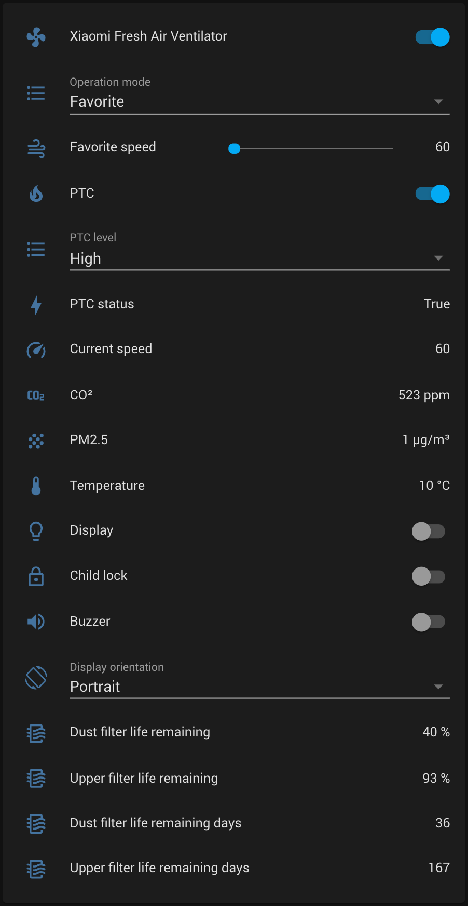

# Mi Fresh Air Ventilator (dmaker.airfresh.t2017)

## Supported features

- Power (on, off)
- Operation modes (Off, Auto, Sleep, Favorite)
- Buzzer (on, off)
- Child lock (on, off)
- Display (on, off), Display orientation (Portrait, LandscapeLeft, LandscapeRight)
- PTC (on, off), PTC level (Low, Medium, High)
- Attributes
  - `model`
  - `mode`
  - `pm25`
  - `co2`
  - `temperature`
  - `favorite_speed`
  - `control_speed`
  - `dust_filter_life_remaining`
  - `dust_filter_life_remaining_days`
  - `upper_filter_life_remaining`
  - `upper_filter_life_remaining_days`
  - `ptc`
  - `ptc_level`
  - `ptc_status`
  - `child_lock`
  - `buzzer`
  - `display`
  - `display_orientation`

### Unsupported features

- Set/Get PTC timer (`set_ptc_timer`, `get_ptc_timer`)
- Get timer (`get_timer`)

## Advanced configuration example




```
fan:
  - platform: xiaomi_miio_airpurifier
    name: Xiaomi Fresh Air Ventilator
    host: <IP_ADDRESS>
    token: <TOKEN>
    model: dmaker.airfresh.t2017

switch:
  - platform: template
    switches:
      xiaomi_fresh_air_ventilator_display:
        friendly_name: Display
        value_template: "{{ is_state_attr('fan.xiaomi_fresh_air_ventilator', 'display', True) }}"
        turn_on:
          service: xiaomi_miio_airpurifier.fan_set_display_on
          data:
            entity_id: fan.xiaomi_fresh_air_ventilator
        turn_off:
          service: xiaomi_miio_airpurifier.fan_set_display_off
          data:
            entity_id: fan.xiaomi_fresh_air_ventilator
        icon_template: mdi:lightbulb-outline
      xiaomi_fresh_air_ventilator_child_lock:
        friendly_name: Child lock
        value_template: "{{ is_state_attr('fan.xiaomi_fresh_air_ventilator', 'child_lock', True) }}"
        turn_on:
          service: xiaomi_miio_airpurifier.fan_set_child_lock_on
          data:
            entity_id: fan.xiaomi_fresh_air_ventilator
        turn_off:
          service: xiaomi_miio_airpurifier.fan_set_child_lock_off
          data:
            entity_id: fan.xiaomi_fresh_air_ventilator
        icon_template: mdi:lock-outline
      xiaomi_fresh_air_ventilator_buzzer:
        friendly_name: Buzzer
        value_template: "{{ is_state_attr('fan.xiaomi_fresh_air_ventilator', 'buzzer', True) }}"
        turn_on:
          service: xiaomi_miio_airpurifier.fan_set_buzzer_on
          data:
            entity_id: fan.xiaomi_fresh_air_ventilator
        turn_off:
          service: xiaomi_miio_airpurifier.fan_set_buzzer_off
          data:
            entity_id: fan.xiaomi_fresh_air_ventilator
        icon_template: mdi:volume-high
      xiaomi_fresh_air_ventilator_ptc:
        friendly_name: PTC
        value_template: "{{ is_state_attr('fan.xiaomi_fresh_air_ventilator', 'ptc', True) }}"
        turn_on:
          service: xiaomi_miio_airpurifier.fan_set_ptc_on
          data:
            entity_id: fan.xiaomi_fresh_air_ventilator
        turn_off:
          service: xiaomi_miio_airpurifier.fan_set_ptc_off
          data:
            entity_id: fan.xiaomi_fresh_air_ventilator
        icon_template: mdi:fire
  
sensor:
  - platform: template
    sensors:
      xiaomi_fresh_air_ventilator_co2:
        friendly_name: CO²
        value_template: '{{ states.fan.xiaomi_fresh_air_ventilator.attributes.co2 }}'
        unit_of_measurement: 'ppm'
        icon_template: mdi:molecule-co2
      xiaomi_fresh_air_ventilator_pm25:
        friendly_name: PM2.5
        value_template: '{{ states.fan.xiaomi_fresh_air_ventilator.attributes.pm25 }}'
        unit_of_measurement: 'µg/m³'
        icon_template: mdi:grain
      xiaomi_fresh_air_ventilator_temperature:
        friendly_name: Temperature
        value_template: '{{ states.fan.xiaomi_fresh_air_ventilator.attributes.temperature }}'
        unit_of_measurement: '°C'
        icon_template: mdi:thermometer
      xiaomi_fresh_air_ventilator_current_speed:
        friendly_name: Current speed
        value_template: '{{ states.fan.xiaomi_fresh_air_ventilator.attributes.control_speed }}'
        icon_template: mdi:speedometer
      xiaomi_fresh_air_ventilator_favorite_speed:
        friendly_name: Favorite speed
        value_template: '{{ states.fan.xiaomi_fresh_air_ventilator.attributes.favorite_speed }}'
        icon_template: mdi:speedometer
      xiaomi_fresh_air_ventilator_ptc_status:
        friendly_name: PTC status
        value_template: '{{ states.fan.xiaomi_fresh_air_ventilator.attributes.ptc_status }}'
        icon_template: mdi:lightning-bolt
      xiaomi_fresh_air_ventilator_dust_filter_life_remaining:
        friendly_name: Dust filter life remaining
        value_template: '{{ states.fan.xiaomi_fresh_air_ventilator.attributes.dust_filter_life_remaining }}'
        unit_of_measurement: '%'
        icon_template: mdi:air-filter
      xiaomi_fresh_air_ventilator_dust_filter_life_remaining_days:
        friendly_name: Dust filter life remaining days
        value_template: '{{ states.fan.xiaomi_fresh_air_ventilator.attributes.dust_filter_life_remaining_days }}'
        icon_template: mdi:air-filter
      xiaomi_fresh_air_ventilator_upper_filter_life_remaining:
        friendly_name: Upper filter life remaining
        value_template: '{{ states.fan.xiaomi_fresh_air_ventilator.attributes.upper_filter_life_remaining }}'
        unit_of_measurement: '%'
        icon_template: mdi:air-filter
      xiaomi_fresh_air_ventilator_upper_filter_life_remaining_days:
        friendly_name: Upper filter life remaining days
        value_template: '{{ states.fan.xiaomi_fresh_air_ventilator.attributes.upper_filter_life_remaining_days }}'
        icon_template: mdi:air-filter

input_number:
  xiaomi_fresh_air_ventilator_favorite_speed:
    name: Favorite speed
    icon: mdi:weather-windy
    initial: 60
    min: 60
    max: 300
    step: 4

input_select:
  xiaomi_fresh_air_ventilator_mode:
    name: Operation mode
    options:
      - Auto
      - Sleep
      - Favorite
  xiaomi_fresh_air_ventilator_ptc_level:
    name: PTC level
    options:
     - Low
     - Medium
     - High
  xiaomi_fresh_air_ventilator_display_orientation:
    name: Display orientation
    icon: mdi:screen-rotation
    options:
      - Portrait
      - LandscapeLeft
      - LandscapeRight

automation:
  - alias: Select favorite speed by slider
    trigger:
      platform: state
      entity_id: input_number.xiaomi_fresh_air_ventilator_favorite_speed
    action:
      - service: xiaomi_miio_airpurifier.fan_set_favorite_speed
        data_template:
          entity_id: fan.xiaomi_fresh_air_ventilator
          speed: '{{ states.input_number.xiaomi_fresh_air_ventilator_favorite_speed.state|int }}'

  - alias: Select favorite speed by slider
    trigger:
      platform: state
      entity_id: input_number.xiaomi_fresh_air_ventilator_favorite_speed
    action:
      - service: xiaomi_miio_airpurifier.fan_set_favorite_speed
        data_template:
          entity_id: fan.xiaomi_fresh_air_ventilator
          speed: '{{ states.input_number.xiaomi_fresh_air_ventilator_favorite_speed.state|int }}'

  - alias: Monitor favorite speed and update slider
    trigger:
      platform: state
      entity_id: sensor.xiaomi_fresh_air_ventilator_favorite_speed
    action:
      service: input_number.set_value
      entity_id: input_number.xiaomi_fresh_air_ventilator_favorite_speed
      data_template:
        value: '{{ states.fan.xiaomi_fresh_air_ventilator.attributes.favorite_speed }}'

  - alias: Select PTC level by input select
    trigger:
      entity_id: input_select.xiaomi_fresh_air_ventilator_ptc_level
      platform: state
    action:
      service: xiaomi_miio_airpurifier.fan_set_ptc_level
      data_template:
        entity_id: fan.xiaomi_fresh_air_ventilator
        level: '{{ states.input_select.xiaomi_fresh_air_ventilator_ptc_level.state }}'

  - alias: Monitor PTC level and update input select
    trigger:
      platform: state
      entity_id: fan.xiaomi_fresh_air_ventilator
    action:
      service: input_select.select_option
      entity_id: input_select.xiaomi_fresh_air_ventilator_ptc_level
      data_template:
        option: >
          {{ states.fan.xiaomi_fresh_air_ventilator.attributes.ptc_level.capitalize() }}
  - alias: Select operation mode by input select
    trigger:
      entity_id: input_select.xiaomi_fresh_air_ventilator_mode
      platform: state
    action:
      service: fan.set_preset_mode
      data_template:
        entity_id: fan.xiaomi_fresh_air_ventilator
        preset_mode: '{{ states.input_select.xiaomi_fresh_air_ventilator_mode.state }}'
  - alias: Monitor operation mode and update input select
    trigger:
      platform: state
      entity_id: fan.xiaomi_fresh_air_ventilator
    action:
      service: input_select.select_option
      entity_id: input_select.xiaomi_fresh_air_ventilator_mode
      data_template:
        option: >
          {{ states.fan.xiaomi_fresh_air_ventilator.attributes.preset_mode }}
  - alias: Select display orientation by input select
    trigger:
      entity_id: input_select.xiaomi_fresh_air_ventilator_display_orientation
      platform: state
    action:
      service: xiaomi_miio_airpurifier.fan_set_display_orientation
      data_template:
        entity_id: fan.xiaomi_fresh_air_ventilator
        display_orientation: '{{ states.input_select.xiaomi_fresh_air_ventilator_display_orientation.state }}'
  - alias: Monitor display orientation and update input select
    trigger:
      platform: state
      entity_id: fan.xiaomi_fresh_air_ventilator
    action:
      service: input_select.select_option
      entity_id: input_select.xiaomi_fresh_air_ventilator_display_orientation
      data_template:
        option: >
          
            LandscapeLeft
          
            LandscapeRight
          
            Portrait
          
```

```
# lovelace card

type: entities
entities:
  - entity: fan.xiaomi_fresh_air_ventilator
  - entity: input_select.xiaomi_fresh_air_ventilator_mode
  - entity: input_number.xiaomi_fresh_air_ventilator_favorite_speed
  - entity: switch.xiaomi_fresh_air_ventilator_ptc
  - entity: input_select.xiaomi_fresh_air_ventilator_ptc_level
  - entity: sensor.xiaomi_fresh_air_ventilator_ptc_status
  - entity: sensor.xiaomi_fresh_air_ventilator_current_speed
  - entity: sensor.xiaomi_fresh_air_ventilator_favorite_speed
  - entity: sensor.xiaomi_fresh_air_ventilator_co2
  - entity: sensor.xiaomi_fresh_air_ventilator_pm25
  - entity: sensor.xiaomi_fresh_air_ventilator_temperature
  - entity: switch.xiaomi_fresh_air_ventilator_display
  - entity: switch.xiaomi_fresh_air_ventilator_child_lock
  - entity: switch.xiaomi_fresh_air_ventilator_buzzer
  - entity: input_select.xiaomi_fresh_air_ventilator_display_orientation
  - entity: sensor.xiaomi_fresh_air_ventilator_dust_filter_life_remaining
  - entity: sensor.xiaomi_fresh_air_ventilator_upper_filter_life_remaining
  - entity: sensor.xiaomi_fresh_air_ventilator_dust_filter_life_remaining_days
  - entity: sensor.xiaomi_fresh_air_ventilator_upper_filter_life_remaining_days
```

Thanks to @skvalex for providing this example.
